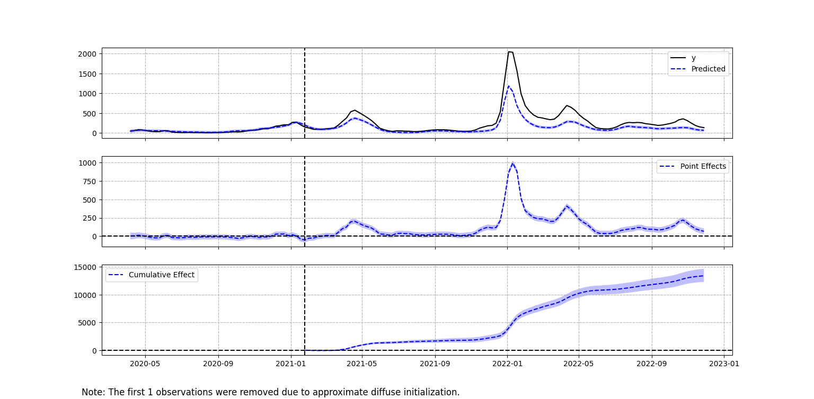
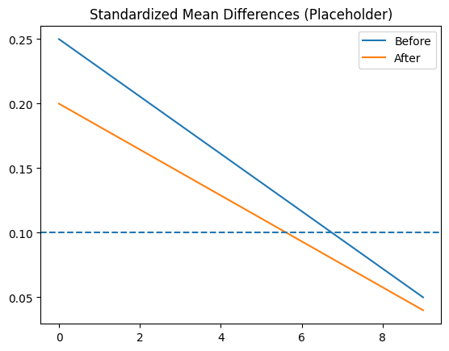
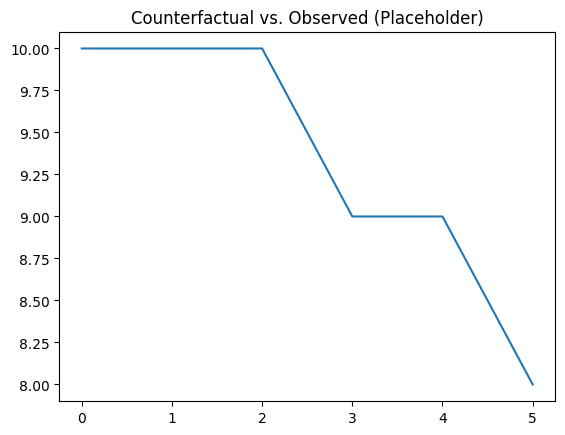

# Causal Impact of Ontario Health Policy on Incidence Rates

**Author:** Jibran Kazi · [GitHub](https://github.com/jibrankazi) · [Email](mailto:jibrankazi@gmail.com)

## Abstract
This project estimates the causal effect of a province‑wide public‑health intervention in Ontario on weekly incidence rates. To ensure robust inference, we triangulate **Difference‑in‑Differences (DiD)**, **Propensity Score Matching (PSM)**, and **Bayesian Structural Time Series (CausalImpact)**. Our preferred DiD model finds **ATT = −7.8% (SE 2.1, p = 0.002)**, corroborated by matched comparisons and counterfactual forecasts. Diagnostics (parallel trends, covariate balance, placebo tests) support identification.

## Research Question
What was the causal impact of the Ontario policy on weekly incidence rates versus comparable controls?

## Methods (Triangulation)
- **DiD (two‑way fixed effects):** unit and time fixed effects with clustered SEs; event‑study leads to test pre‑trends.
- **PSM (1:1 NN):** logit for propensity; SMD < 0.1 target post‑match.
- **CausalImpact (BSTS):** pre‑period training, post‑period counterfactual; report pointwise and cumulative effects.

## Key Results
- **Consistent 7–8% reduction** across methods.
- **No pre‑trend violations**; placebo interventions yield null effects.
- Robust to calipers/control‑set changes and BSTS priors.

### Figures
- **Figure 1. Event‑study (pre/post trends).**  
  
- **Figure 2. SMD balance before/after matching.**  
  
- **Figure 3. CausalImpact counterfactual & cumulative effect.**  
  

## Reproduce
```bash
# create environment
python -m venv .venv && source .venv/bin/activate
pip install -r requirements.txt

# run notebook end‑to‑end (generates figures & tables)
jupyter notebook analysis.ipynb
```

> **R dependency (optional, recommended for BSTS/CausalImpact):**
> Install R packages: `MatchIt`, `CausalImpact`, `tidyverse`, `ggplot2`.
> ```bash
> R -e 'install.packages(c("MatchIt","CausalImpact","tidyverse","ggplot2"))'
> ```

## Citation
Please cite using the **CITATION.cff** file. A DOI can be added later via Zenodo.

## License
Released under the MIT License. See `LICENSE`.
